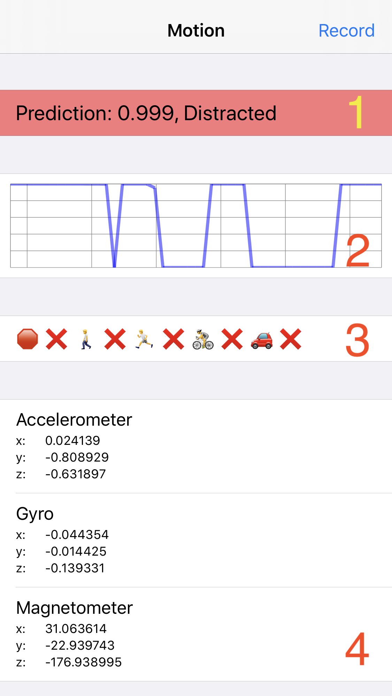
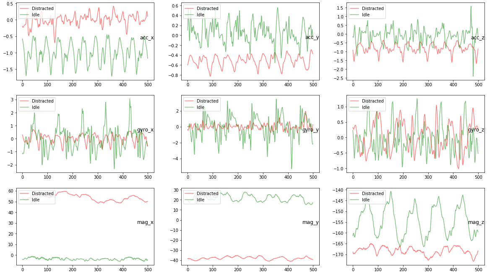
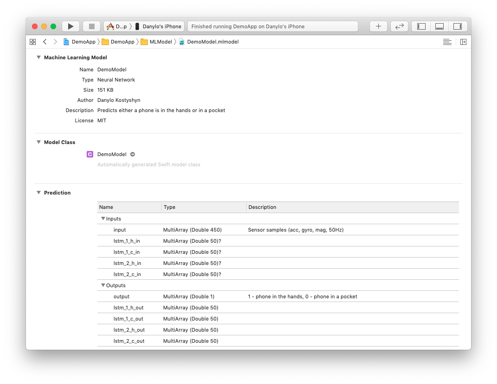
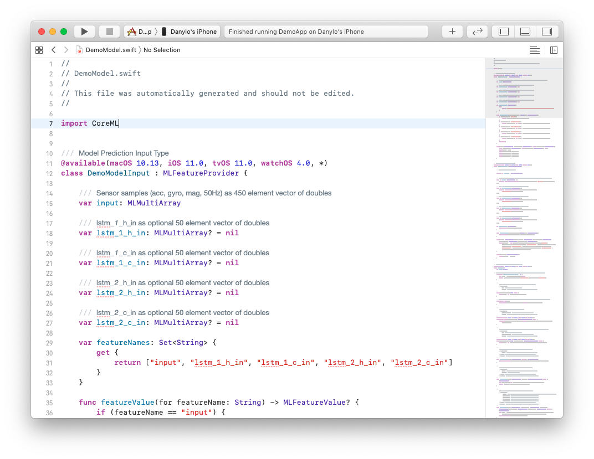

# Using CoreML to predict user's distraction level

## Danylo Kostyshyn

### [@danylo_kos](https://twitter.com/danylo_kos)

---

## PoC application which predicts user distraction level when he is near or about to cross the road 🚦

---

## Idea

1. user enters an iBeacon 🗼 region
1. app wakes up in a background
1. predicts if user is currently distracted
1. shows a notification
1. ????
1. PROFIT!!!

---

## Motion sensors available on iPhone

- **accelerometer** - acceleration of the device in three dimensional space ✅
- **gyroscope** - rotation around the device's three primary axes ✅
- **magnetometer** - device's orientation relative to Earth's magnetic field ✅
- **altimeter** - reflects the change in the device's current altitude, not the absolute altitude ❌

---

## Sample inputs from sensors and train recurrent neural net on those samples

---

**3** sensors (accelerometer, gyro and magnetometer)
&times; **3** axis (x, y, z)
&times; **50Hz** (update rate)
= **450** inputs for ML model

---

## Demo app to gather data samples

1. current model prediction
1. predictions for last minute
1. `CMMotionActivity`
    `.stationary` 🛑
    ‍`.walking` 🚶
    ‍`.running` 🏃
    ‍`.cycling` 🚴
    `.automotive` 🚗
1. real-time sensory outputs



---

## Raw data samples

```sh
mode, timestamp, acc_x, acc_y, acc_z, gyro_x, gyro_y, gyro_z, mag_x, mag_y, mag_z
```

```sh
1,1575671757,0.013062,-0.509857,-0.406815,0.119206,0.057954,-0.416490,26.258835,-32.553253,-170.973480
1,1575671757,0.023483,-0.510574,-0.408905,0.045440,0.036428,-0.421204,26.628006,-32.639603,-170.687622
1,1575671757,0.033401,-0.515900,-0.429352,-0.008224,-0.014894,-0.446239,26.701782,-32.571411,-170.772003
1,1575671757,0.025345,-0.517944,-0.466064,-0.017717,-0.058564,-0.471437,27.080017,-32.891464,-170.404434
1,1575671757,0.011124,-0.521149,-0.517227,0.005385,-0.020188,-0.412446,27.238525,-33.162476,-170.526062
...
```

---

## Random samples of 10 sec at 50Hz



---

## Frameworks used

- `TensorFlow 1.15.0`
- `Keras 2.3.1`
- because CoreML converter doesn't currently have full support of TF 2.0 (RNN models)
- Apple's `coremltools 3.1`

---

## Model architecture

- 2 &times; LSTM layer with dropout
- 2 &times; dropout layer
- 2 &times; dense layer

```sh
LSTM_50 -> Dropout_0.5 -> LSTM_50 -> Dropout_0.5 -> Dense_relu_100 -> Dense_sigmoid_1
```

---

## Keras model definition

```python
def MyModel_LSTM():
    in_data = Input(shape=(50*9, ), dtype='float32')
    X = Reshape((50,9,), input_shape=(50*9,))(in_data)
    X = LSTM(50, return_sequences=True)(X)
    X = Dropout(0.5)(X)
    X = LSTM(50)(X)
    X = Dropout(0.5)(X)
    X = Dense(100, activation='relu')(X)
    X = Dense(1, activation='sigmoid')(X)
    model = Model(inputs=in_data, outputs=X)
    return model
```

---

## CoreML

- use Apple's `coremltools` Python package to convert TensorFlow/Keras `.h5`-format model into CoreML `.mlmodel`

---

# Xcode



---

# Motion tracking in background hack

Doesn't work anymore (last checked iPhone X, iOS 13) :(

```swift
func keepBackgroundMotionUpdatesRunning() {
    try? AVAudioSession.sharedInstance().setCategory(.playback)
    try? AVAudioSession.sharedInstance().setActive(true)

    let path = Bundle.main.path(forResource: "5-seconds-of-silence.mp3", ofType: nil)
    let fileURL = URL(fileURLWithPath: path!)
    player = AVPlayer(url: fileURL)
    player.play()

    NotificationCenter.default.addObserver(forName: .AVPlayerItemDidPlayToEndTime,
                                            object: self.player.currentItem,
                                            queue: .main) { [weak self] _ in
                                            self?.player.seek(to: CMTime.zero)
                                            self?.player.play()
    }
}
```

---

# CoreML API

```swift
let model = DemoModel()

func predictMode(_ dataArray: [(CMAccelerometerData, CMGyroData, CMMagnetometerData)]) -> Double {
    // 1. Unroll array of 3 data sources into an array of single vectors
    // [[x1, y1, z1, x2, y2, z2, x3, y3, z3]]
    var dataItems = [[Double]]()
    for (accData, gyroData, magData) in dataArray {
        let data = [accData.acceleration.x, accData.acceleration.y, accData.acceleration.z,
                    gyroData.rotationRate.x, gyroData.rotationRate.y, gyroData.rotationRate.z,
                    magData.magneticField.x, magData.magneticField.y, magData.magneticField.z]
        dataItems.append(data)
    }

    // 2. Create MLMultiArray of 450x1 dimensions and populate it with data
    guard let inputData = try? MLMultiArray(shape: [450], dataType: .float32) else { return 0.0 }
    for (dataItemIndex, dataItem) in dataItems.enumerated() {
        for featureIndex in 0..<9 {
            let feature = dataItem[featureIndex]
            let inputDataIndex = dataItemIndex + featureIndex * 50
            inputData[inputDataIndex] = NSNumber(value: feature)
        }
    }

    // 3. Create input object for model
    let modelInput = DemoModelInput(input: inputData)
    let options = MLPredictionOptions()
    options.usesCPUOnly = true // iOS doesn't allow to perform any code on GPU in background

    // 4. Predict!
    do {
        let modelOutput = try model.prediction(input: modelInput, options: options)
        return modelOutput.output[0].doubleValue
    } catch {
        print("\(error)")
    }
    return 0.0
}
```

---

# Demo

---

# Projects are available at github.com/danylokos

- [ML Model Jupyter Nobook](https://github.com/danylokos/activity-demo-model)
- [iOS demo app](https://github.com/danylokos/activity-demo-app)
- [Slides](https://github.com/danylokos/activity-slides)
